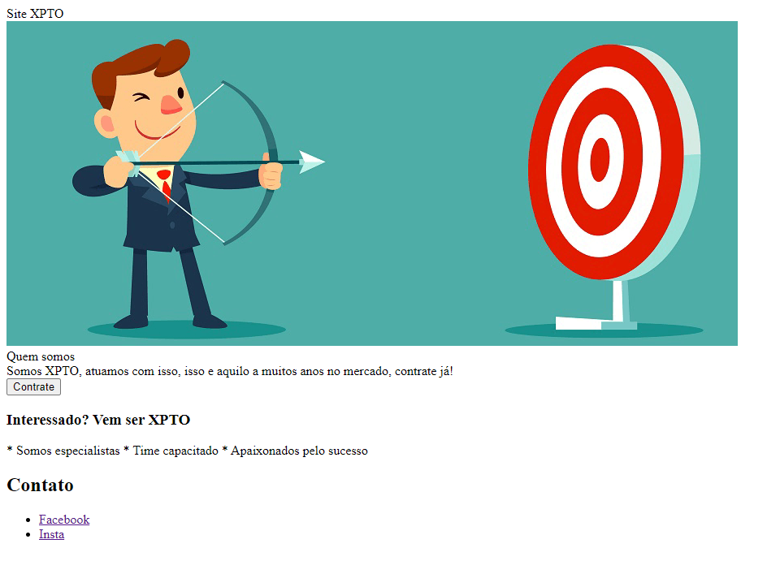
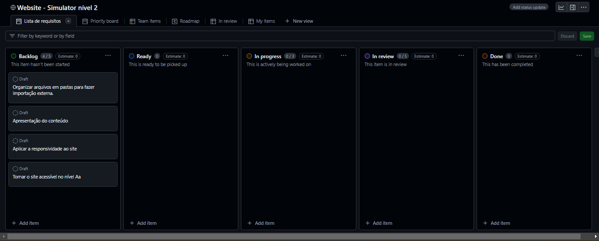
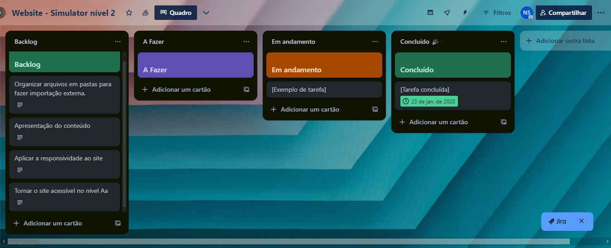
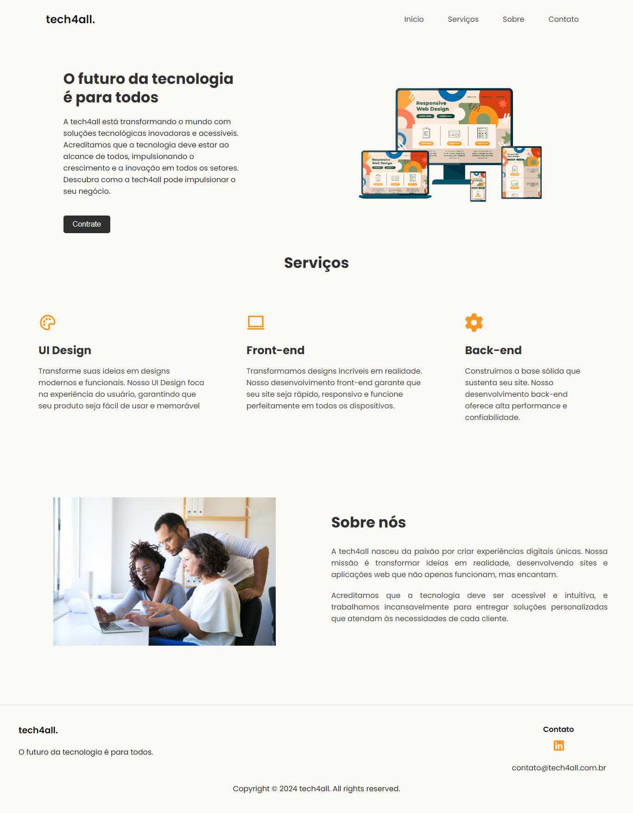

<h1 align=center>Simulator Télos nível 2 - Website 🚀</h1>

Este projeto consiste na melhoria de um sistema legado. O website precisa ser responsivo, acessível, estilizado e de fácil manutenção.

__Apresentação do conteúdo:__

- Banner
- Texto da seção
- Call to action
- Conteúdo
- Rodapé 

__Critérios de aceitação:__

- Clean code
- Acessibilidade no nível Aa

#

<h3>Versão do sistema legado</h3>

---

### Validação

> Você pode acompanhar o desenvolvimento desse projeto acessando a aba ["Projects"](https://github.com/hilanasilv/desafio-manutencao-Nayla-Hilana/projects) e selecionando o [projeto em aberto](https://github.com/users/hilanasilv/projects/2). 

> Se preferir, você também pode acompanhar através do [Trello](https://trello.com/b/a2CQ60z5/website-simulator-nivel-2).

---

<h3>Versão atualizada</h3>

---

<footer align=center>
  
Desenvolvido por Nayla Hilana

</footer>
